[Kotisivu](index.html)
[Infosivu](pages/about.html)

# Tehtävä 1
Tehtävänä oli asentaa seuraavat työkalut:
- Robot Framework
- Browser Library
- Requests library
- CryptoLibrary
- Robotidy

Robot framework asennettiin komennolla:
"python -m pip install robotframework"
Asennuksen onnistuminen varmistettiin komennolla:
"robot --version"

Browser library asennettiin komennolla: 
"pip install robotframework-browser"
kirjaston toiminta alustettiin komennolla: 
"rfbrowser init"

Requests library asennettiin komennolla:
"pip install robotframework-requests"

CryptoLibrary asennettiin komennolla: 
"pip install --upgrade robotframework-crypto"

Robotidy asennettiin komennolla: 
"pip install robotframework-tidy"

Lopuksi asennuksien onnistuminen varmistettiin komennolla:
"pip freeze"

# Tehtävä 2

Sain toimimaan kirjautumisen testauksen.
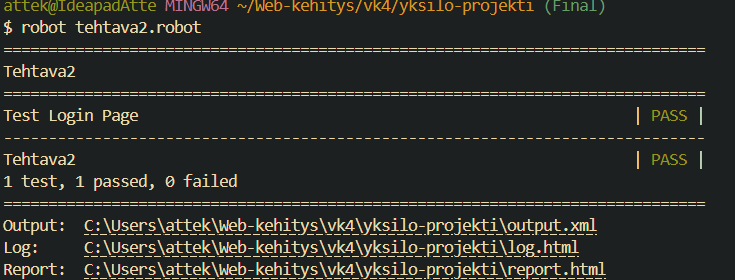

# Tehtävä 3

Sain testattua. tekstikentän, salasanan, testialueen, pudotusvalikon, checkboxin, radiopainikkeen ja
päivämäärän valinnan.
. 
Datalist dropdownia, file inputtia, värivalitsinta ja liu'utinta en saanut toimimaan.

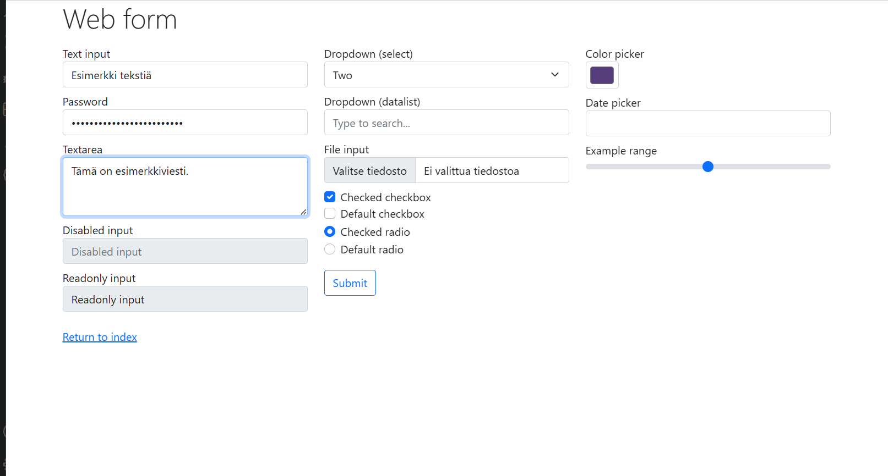

    
# Tehtävä 4

Päiväkirjamerkinnän lisääminen onnistui.

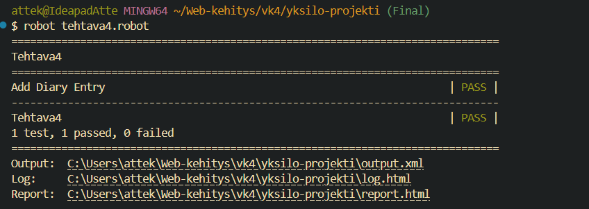

# Tehtävä 5

Kirjautuminen onnistui käyttäjätunnukselle ja salasanalla jotka haettiin .env tiedostosta.

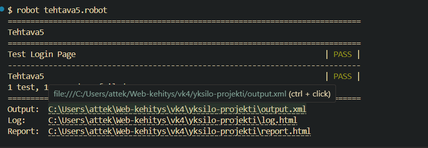

# Tehtävä 6

Kirjautuminen onnistui kryptatuilla käyttäjätunnuksella ja salasanalla.

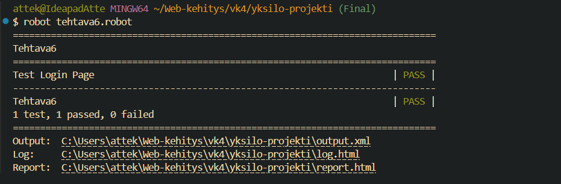

# Tehtävä 7

Siirsin log- tiedostot testing- kansioon.

#Kuvat käyttöliittymästä.

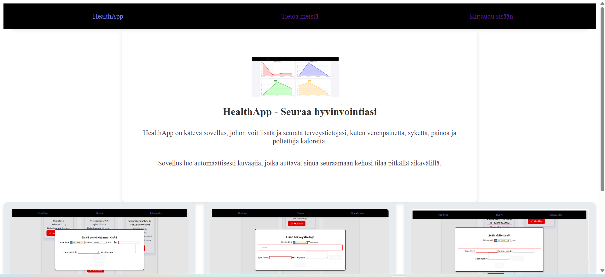
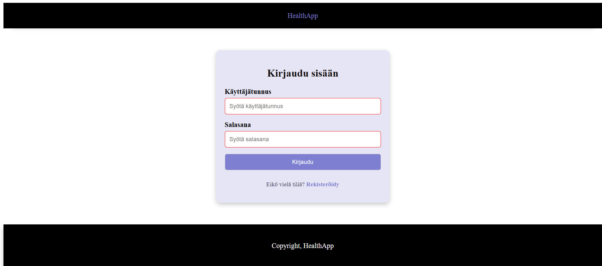
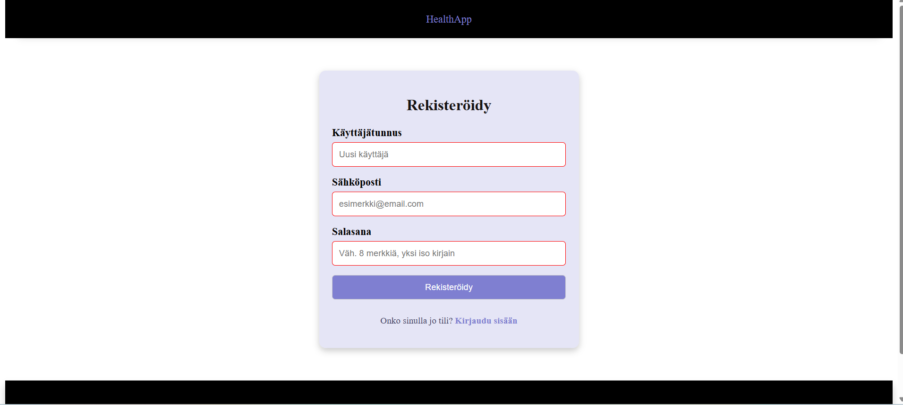
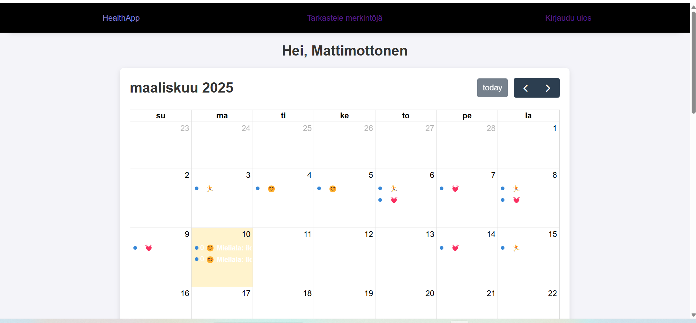
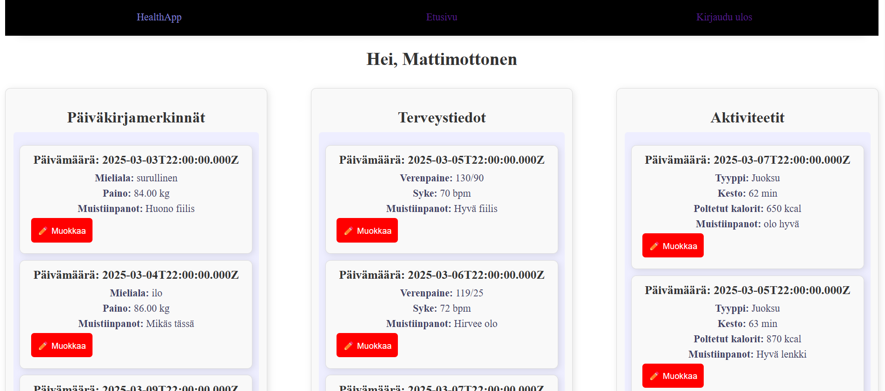

#Reitti apidokumentaatioon.
#http://localhost:5000/docs/

#Linkki sovellukseen

https://users.metropolia.fi/~attekang/Yksilo-projekti/dist/src/pages/frontpage.html

#Reitti backend-sovellukseen
http://localhost:5000/api/

#Käyttöliittymä kuvattu kaaviona.
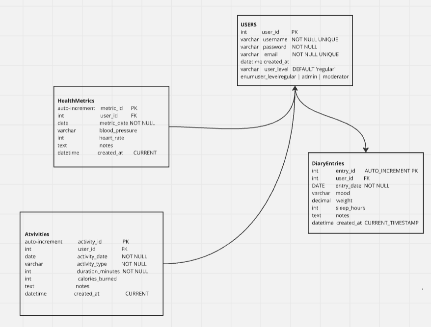

#Toteutetut toiminnallisuudet
-Kirjautuminen
-Rekistöröityminen
-Merkinnän, terveystiedon, aktiviteetin hakeminen
-Merkinnän, terveystiedon, aktiviteetin lisääminen
-Merkinnän, terveystiedon, aktiviteetin poistaminen
-Merkinnän, terveystiedon ja aktiviteetin lisääminen javascript kalenteriin.
-Kuvaajien luominen verenpaineen, sykkeen, kalorien kulutuksen ja painon muutoksesta.

#Bugit
-Merkinnän, terveystiedon tai aktiviteetin muokkaaminen ei onnistu.
-Merkinnän, terveystiedon, aktiviteetin voi lisätä vain "tarkastele merkintöjä"-osiosta, ei suoraan kalenterista.

#Tekoäly
-Chatgpt:tä käytetty apuna.

