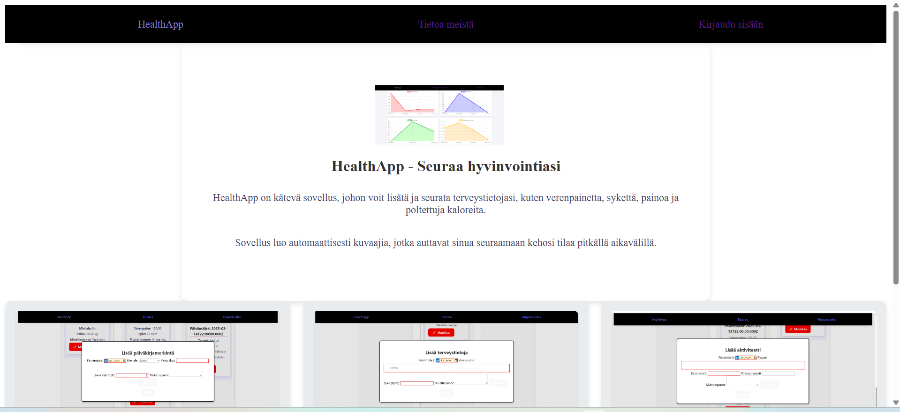
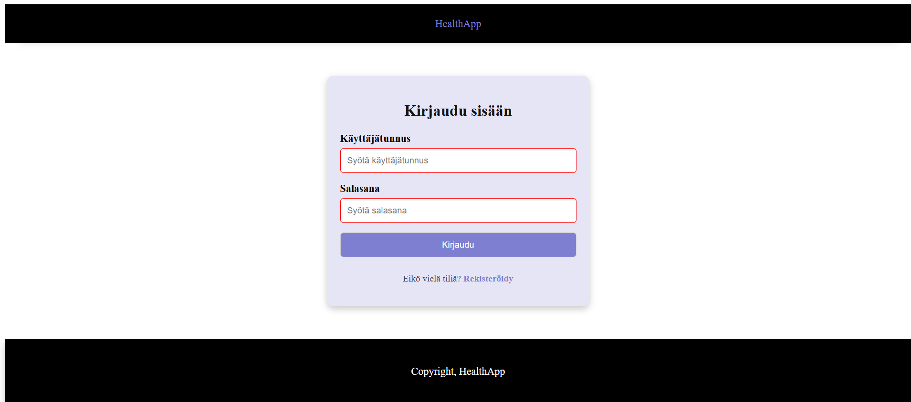
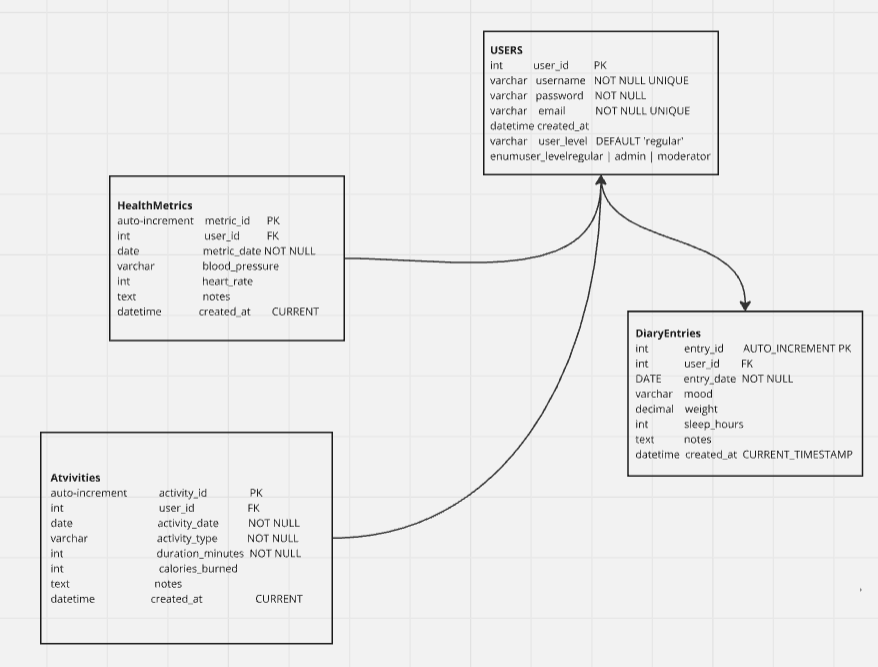

#Kuvat käyttöliittymästä.

#Reitti apidokumentaatioon.
#http://localhost:5000/docs/

#Linkki sovellukseen

https://users.metropolia.fi/~attekang/Yksilo-projekti/dist/src/pages/frontpage.html

#Reitti backend-sovellukseen
http://localhost:5000/api/

#Käyttöliittymä kuvattu kaaviona.

#Toteutetut toiminnallisuudet
-Kirjautuminen
-Rekistöröityminen
-Merkinnän, terveystiedon, aktiviteetin hakeminen
-Merkinnän, terveystiedon, aktiviteetin lisääminen
-Merkinnän, terveystiedon, aktiviteetin poistaminen
-Merkinnän, terveystiedon ja aktiviteetin lisääminen javascript kalenteriin.
-Kuvaajien luominen verenpaineen, sykkeen, kalorien kulutuksen ja painon muutoksesta.

#Bugit
-Merkinnän, terveystiedon tai aktiviteetin muokkaaminen ei onnistu.
-Merkinnän, terveystiedon, aktiviteetin voi lisätä vain "tarkastele merkintöjä"-osiosta, ei suoraan kalenterista.

#Tekoäly
-Chatgpt:tä käytetty apuna.